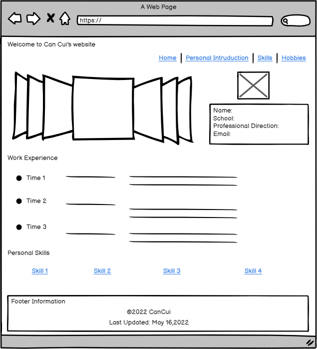
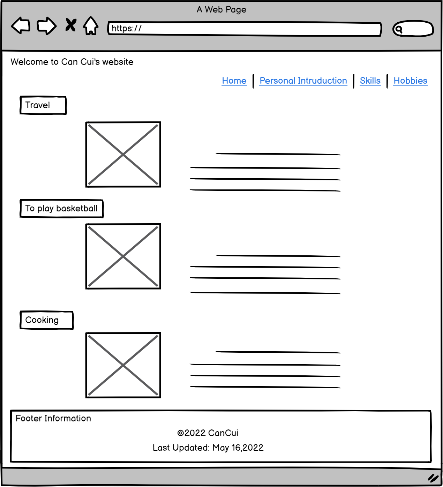

# Can Cui's Inf6420 Project In The Second Week

A portfolio site showcasing my work.

## Wireframes-Home Page

**Header** - will include my name and my navigation menu.

**Navigation Menu** - will include link to other pages like "Personal Introduction","Skills" and "Hobbies".

**Main Content** - will include my basic information  ,my work experience at various stages, and the skills I'm good at.What's more, I also use scrolling pictures to present my image.

**Footer** - will include copyright information

## Wireframes- Skills Page

**Main Content** - each skill was described in detail in the form of modules, and my future career direction was added at the bottom of the content.

## Wireframes-Hobbies Page

**Main Content** - this page shows my hobby type in the form of combination of pictures and texts to make the content more vivid ,and I will use a different color background to distinguish my skills.